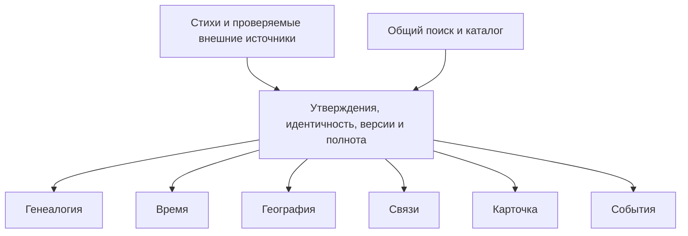

# Основа нового приложения для изучения Библии

Версия 0.7 • 9 октября2026 • **локальная документация нового приложения; F1 начат, полный продукт не реализован**.

Цель — помочь ребёнку 8–12 лет, взрослому читателю и исследователю наглядно изучать канон из 66 книг Синодального перевода. По прямому решению владельца приложение создаётся с нуля и содержит **шесть основных разделов: Генеалогия, Время, География, Связи, Карточка, События**. Они используют одну проверяемую базу и один поиск. Достоверность, понятность, приятное оформление и отзывчивость проверяются раздельно; принятое число разделов не заменяет проверку их удобства.

Разработка прежнего ToliDot завершена. По последнему уточнению владельца из него переносится только частично созданная база персонажей/утверждения/ссылки после новой сверки. Сохранённые корпус и журналы помогают проверять источник, а не автоматически принимаются как готовая база. Новые интерфейс, дизайн, механика, прикладная логика и код строятся с нуля по задачам шести разделов. Работа и документы находятся на этом компьютере; проект не публикуется и не отправляется на GitHub.

Главная проектируется как **библиотека всех библейских историй**, с книгами/Заветами и открытым статусом охвата. Страница истории даёт текст, отдельные рассказы/пересказы, действующих участников, другие упоминания и переходы к инструментам. Это читательский режим Событий, использующий общие ID. Исследование фрагментов всего канона обязательно; популярная подборка не считается полным каталогом.

Для чтения нынешнего расширения начните с [библиотеки и главной18](18-story-library-and-home.md), [источников02](02-sources-and-evidence.md) и [стандарта качества19](19-quality-and-review-standard.md). Далее — общая модель и отдельные инструменты. Эти документы задают следующий результат; новый UI и все истории в данном шаге не создавались.

## Шесть основных разделов

| Инструмент | Главный вопрос | Основное представление | Граница |
|---|---|---|---|
| Генеалогия | Кто кому родственник? | Люди, семейные союзы и происхождение | Без годов, длительности жизни, географии и социальных связей |
| Время | Когда жил участник, в какой эпохе и с кем совпадало его время? | Жизни, эпохи и временные ограничения; события как обозначенный контекст | Без семейного дерева, маршрутов и второго каталога событий |
| География | Где был человек и что известно о перемещении? | Места и последовательности остановок | Координаты/путь не выдаются за точные слова Писания |
| Связи | Как участники взаимодействовали? | Типизированные отношения и события | Родство передаётся в Генеалогию; соседство упоминаний не равно встрече |
| Карточка | Что известно об этом участнике и откуда? | Единый порядок разделов, адаптация к объёму | Не заполняет отсутствие сведений вымышленной биографией |
| События | Какую историю изучить, что произошло и откуда это известно? | Библиотека историй, страницы эпизодов, последовательность/шкала/карта | StoryID — единица чтения, EventID — происшествие; общий текст/данные |

Из каждого инструмента доступны Карточка и переход к тому же лицу в другом инструменте. Постоянные ID лиц, мест, событий и утверждений исключают отдельные копии биографии и эпизода. Переход не меняет степень достоверности сведений.

## Документы и порядок чтения

1. [Стратегия и границы](01-strategy.md).
2. [Источники и достоверность](02-sources-and-evidence.md).
3. [Общая модель и соответствие стихов](03-data-contract.md).
4. [Генеалогия](04-genealogy.md).
5. [Время](05-time.md).
6. [География](06-geography.md).
7. [Связи](07-connections.md).
8. [Карточка](08-person-card.md).
9. [Интерфейс, дизайн и доступность](09-experience-and-design.md).
10. [Архитектура и производительность](10-architecture-and-performance.md).
11. [Роли, проверка и этапы](11-governance-and-roadmap.md).
12. [Риски, решения и незакрытые исследования](12-decisions-and-open-questions.md).
13. [Полнота всех действующих лиц канона](13-canonical-coverage.md).
14. [Колена, роды и прототипы навигации](14-tribes-and-area-navigation.md).
15. [События: границы, точки, общие участники и сравнение представлений](15-events-workspace.md).
16. [Исторический разбор Mappable и ограничения базы знаний](16-mappable-reference-review.md).
17. [Подготовка общей базы знаний: протокол F1, миграция и первый набор](17-knowledge-preparation.md).
18. [Библиотека всех библейских историй и содержательная главная](18-story-library-and-home.md).
19. [Качество каждого инструмента, исследования и независимая критика](19-quality-and-review-standard.md).

Карточки охватывают всех индивидуализированных участников и референтов: людей, духовных существ, отдельных животных и другие типы по тексту. Коллективы, виды, образы видений и служебные слоты учитываются отдельно. Генеалогия даёт полный доступ к принятым родственным цепочкам и обзор самостоятельных областей, домов и перечней. Геометрия, оформление и конкретные механики остаются гипотезами для сравнения; новое прямое решение о шести разделах имеет приоритет над прежней гипотезой пяти входов.

Исследования: [все действующие лица и области](research/actor-scope-and-genealogy-areas.md), [родство и доказательства](research/genealogy-and-evidence.md), [время и география](research/time-and-geography.md). Реестры этих пакетов описывают прочитанные источники и границы доступа. [Реестр интерфейсных и технических источников](research/experience-architecture-sources.json) отделяет стандарты от проектных гипотез. Список документов — состав проекта документации, а не объявление их утверждёнными.

Дополнение v0.2 о коленах: [предметная спецификация14](14-tribes-and-area-navigation.md), [библейская модель](research/tribal-models.md), [независимая рецензия](reviews/tribal-navigation-review.md). Ещё три замечания о составе/типах целей/переносе обучения исправлены и адресно перепроверены. Прототипы и человеческие испытания пока не выполнены.

Дополнение v0.3 о Событиях: [спецификация15](15-events-workspace.md), [адресная событийная модель](research/events-evidence-model.md), [первичные исследования и пределы чтения](research/events-design-sources.json), [независимая рецензия](reviews/events-workspace-review.md). Пять замечаний о роли/фазе/интервалах/неизвестности/методике сравнения исправлены и адресно перепроверены в той редакции. В v0.5 События приняты отдельным основным разделом; сравниваются его представления, управление и понимание, а не наличие шестого входа. Два одновременно открытых вида и размер по «важности» требуют отдельной проверки. Это документация для дальнейшей работы, не реализованный инструмент.

Дополнение v0.4 о Mappable: [разбор16](16-mappable-reference-review.md), [оценка новой базы](research/mappable-data-assessment.md), [версия и пределы чтения](research/mappable-review-sources.json), [независимая проверка](reviews/mappable-reference-review.md). Это исходный репозиторий прежнего проекта: новая версия добавляет подготовительные данные и документы, код карты остался прежним. Уточнение о неполной фильтрации сборщика исправлено и адресно перепроверено в ограниченном обзоре. После решения v0.5 описание его механик — исторический материал, а не план их переноса. Используется только база знаний после проверки.

Уточнение v0.5: владелец подтвердил шесть разделов и полную смену идеи приложения. Архивные интерфейс, дизайн, код, механика и логика ToliDot исключены из новой разработки. Прежние исследования и рецензии сохраняют свои даты и охват; формулировки о пяти входах или переносе механик не являются текущими требованиями.

Дополнение v0.6: начат F1 — [протокол17](17-knowledge-preparation.md) и отдельная [область знаний](../../knowledge/README.md). Подготовлен структурный manifest66 и обратимый индекс2963 кандидатов. Первый набор семьи Авраама (13 лиц/3 контекста/31 утверждение) независимо принят для ограниченного охвата; [рецензия](reviews/f1-family-and-protocol-review.md). [Проверка кода](reviews/f1-validator-review.md) нашла и перепроверила исправление ссылки на говорящего. Два дефекта цифрового источника остаются в очереди O3a. Полный F1 и контрольная матрица прототипов ещё не закрыты.

Дополнение v0.7: [предметное исследование историй](research/story-catalogue-data-model.md), [первичные источники/точный охват](research/story-catalogue-sources.json), [аннотированные читательские схемы](research/story-catalogue-experience.md). Два bounded Astra/ultra агента независимо критиковали договоры ведущего: [данные](reviews/story-library-data-review.md), [сценарии](reviews/story-library-experience-review.md). Найдены и исправлены пять P2: порядок ST, граница источникового карантина, отсутствующий класс справочных работ, область фильтра Завета и смешение разных свидетельств с независимыми. Адресные повторные проверки/точные ревизии сохранены в отчётах. Эти рецензии не принимают полный канон, реальную визуальную реализацию или последующие изменения автоматически.

Качество усиливается для всех шести инструментов, а не одного красивого примера: собственная спецификация/контрпримеры/источники/сценарии, независимая критика, доступность и профиль скорости по19. Любая известная подтверждённая неисправленная ошибка блокирует выпуск. Честно обозначенная неоднозначность текста допустима; обещание отсутствия всех ещё не обнаруженных ошибок не подменяет проверку. Авторитетные христианские работы имеют отдельный справочный статус/метод/прочитанные страницы; известное учреждение и индекс имён не заменяют стих.

## Статус и пределы

Документы являются проектной спецификацией; состав шести разделов принят владельцем. Два независимых рецензента проверили смысл/данные и сценарии/архитектуру первоначальной редакции. Их семь документальных замечаний исправлены и адресно перепроверены: [данные](reviews/data-review.md), [сценарии](reviews/experience-review.md). Для проверенных редакций в заявленном охвате открытых конкретных замечаний нет; это не независимая приёмка всех фактов, последующих изменений или доказательство удобства. Статус этапов — в документе 11. Пользовательские задания, визуальные варианты нового интерфейса и измерения нового приложения ещё не выполнялись. Агентские советы не объявляются человеческой экспертизой библеиста или пользовательским исследованием.

Источники открыты для чтения в разной степени; право импортировать данные/карты проверяется для каждого материала отдельно. Полный перенос всех строк внешних баз не запланирован. Не найдена и не предполагается одна универсальная карта, одобренная всем «христианским научным сообществом».

Частичная база персонажей — материал повторной атомарной проверки и тождества тёзок по02. Инвентаризация20 томов дала **2963 записи**, без повторяющихся ID в этом наборе; это не число принятых лиц или доказанных фактов. [Инвентаризация](research/existing-data-inventory.json) и [снимок сохранности](research/preservation-before.json) фиксируют исходную границу. [Историческая проверка документов и24 файлов](research/document-check.json) не обнаружила изменения этих материалов в своей редакции. Старый TSV имеет известные источниковые дефекты и не объявлен удостоверенным официальным изданием; исходники/история сохраняются восстановимыми. Архивный код/дизайн/механика в новое приложение не входят.

Работа ведётся локально. Нет публикации, нового сервера, прототипа, импорта источников в production или изменения прежней карты.
