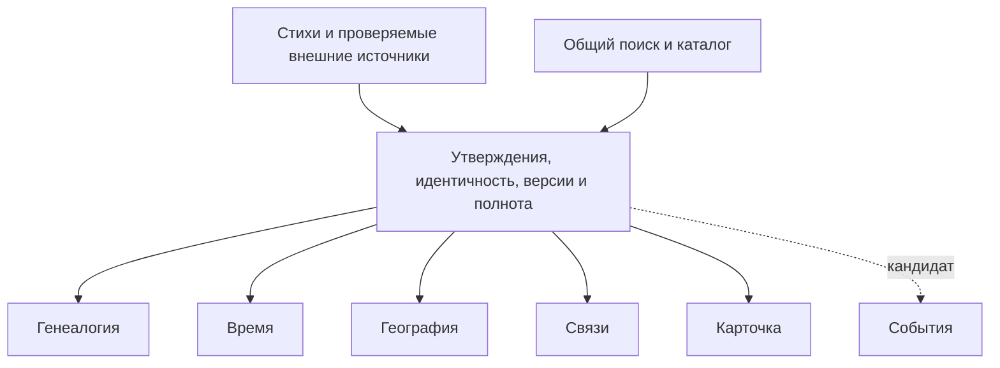

# Основа нового приложения для изучения Библии

Версия 0.3 • 9 октября 2026 • **проект документации; текущий этап — исследование и планирование**.

Цель — помочь ребёнку 8–12 лет, взрослому читателю и исследователю наглядно изучать канон из 66 книг Синодального перевода. Пять базовых инструментов и кандидатный отдельный вход «События» используют одну проверяемую базу и один поиск. Число входов уточняется сравнением задач. Достоверность, понятность, приятное оформление и отзывчивость проверяются раздельно; удачная картинка не подтверждает библейские факты.

## Предлагаемая структура

| Инструмент | Главный вопрос | Основное представление | Граница |
|---|---|---|---|
| Генеалогия | Кто кому родственник? | Люди, семейные союзы и происхождение | Без годов, длительности жизни, географии и социальных связей |
| Время | Когда жил человек или произошло событие? | Отдельные представления жизней и событий | Без семейного дерева и географических маршрутов |
| География | Где был человек и что известно о перемещении? | Места и последовательности остановок | Координаты/путь не выдаются за точные слова Писания |
| Связи | Как участники взаимодействовали? | Типизированные отношения и события | Родство передаётся в Генеалогию; соседство упоминаний не равно встрече |
| Карточка | Что известно об этом участнике и откуда? | Единый порядок разделов, адаптация к объёму | Не заполняет отсутствие сведений вымышленной биографией |
| События — кандидатный шестой вход | Что произошло, с кем, что известно о времени/месте? | Подборка эпизодов, последовательность, шкала или карта | Единый EventID; отдельный вход сравнивается с размещением внутри Времени |

Из каждого инструмента доступны Карточка и переход к тому же лицу в другом инструменте. Постоянные ID лиц, мест, событий и утверждений исключают отдельные копии биографии и эпизода. Переход не меняет степень достоверности сведений.

## Документы и порядок чтения

1. [Стратегия и границы](01-strategy.md).
2. [Источники и достоверность](02-sources-and-evidence.md).
3. [Общая модель и соответствие стихов](03-data-contract.md).
4. [Генеалогия](04-genealogy.md).
5. [Время](05-time.md).
6. [География](06-geography.md).
7. [Связи](07-connections.md).
8. [Карточка](08-person-card.md).
9. [Интерфейс, дизайн и доступность](09-experience-and-design.md).
10. [Архитектура и производительность](10-architecture-and-performance.md).
11. [Роли, проверка и этапы](11-governance-and-roadmap.md).
12. [Риски, решения и незакрытые исследования](12-decisions-and-open-questions.md).
13. [Полнота всех действующих лиц канона](13-canonical-coverage.md).
14. [Колена, роды и прототипы навигации](14-tribes-and-area-navigation.md).
15. [События: границы, точки, общие участники и сравнение представлений](15-events-workspace.md).

Карточки охватывают всех индивидуализированных участников и референтов: людей, духовных существ, отдельных животных и другие типы по тексту. Коллективы, виды, образы видений и служебные слоты учитываются отдельно. Генеалогия даёт полный доступ к принятым родственным цепочкам и обзор самостоятельных областей, домов и перечней. Предложения владельца служат гипотезами для сравнения: обоснованное улучшение допускается без превращения каждого предложения в запрет.

Исследования: [все действующие лица и области](research/actor-scope-and-genealogy-areas.md), [родство и доказательства](research/genealogy-and-evidence.md), [время и география](research/time-and-geography.md). Реестры этих пакетов описывают прочитанные источники и границы доступа. [Реестр интерфейсных и технических источников](research/experience-architecture-sources.json) отделяет стандарты от проектных гипотез. Список документов — состав проекта документации, а не объявление их утверждёнными.

Дополнение v0.2 о коленах: [предметная спецификация14](14-tribes-and-area-navigation.md), [библейская модель](research/tribal-models.md), [независимая рецензия](reviews/tribal-navigation-review.md). Ещё три замечания о составе/типах целей/переносе обучения исправлены и адресно перепроверены. Прототипы и человеческие испытания пока не выполнены.

Дополнение v0.3 о Событиях: [спецификация15](15-events-workspace.md), [адресная событийная модель](research/events-evidence-model.md), [первичные исследования и пределы чтения](research/events-design-sources.json), [независимая рецензия](reviews/events-workspace-review.md). Пять замечаний о роли/фазе/интервалах/неизвестности/методике сравнения исправлены и адресно перепроверены. Рекомендуется проверить отдельный вход и одно главное представление с переключением; два одновременно открытых вида и размер по «важности» требуют отдельной проверки. Это документация для дальнейшей работы, не реализованный шестой инструмент.

## Статус и пределы

Документы являются предлагаемой спецификацией. Два независимых рецензента проверили смысл/данные и сценарии/архитектуру. Их семь документальных замечаний исправлены и адресно перепроверены: [данные](reviews/data-review.md), [сценарии](reviews/experience-review.md). В проверенном охвате открытых конкретных замечаний нет; это не независимая приёмка всех фактов или доказательство удобства. Статус этапов — в документе 11. Пользовательские задания, визуальные варианты нового интерфейса и измерения нового приложения ещё не выполнялись. Агентские советы не объявляются человеческой экспертизой библеиста или пользовательским исследованием.

Источники открыты для чтения в разной степени; право импортировать данные/карты проверяется для каждого материала отдельно. Полный перенос всех строк внешних баз не запланирован. Не найдена и не предполагается одна универсальная карта, одобренная всем «христианским научным сообществом».

Из прежнего проекта сохраняются данные, Синодальный текст, ссылки, исследования, линии Мессии и история проверок. Их качество проверяется до миграции. Инвентаризация текущих 20 томов дала **2963 записи**, без повторяющихся ID в этом наборе; это не число принятых лиц или доказанных фактов. [Инвентаризация](research/existing-data-inventory.json) и [снимок сохранности](research/preservation-before.json) фиксируют границу. [Проверка документов и 24 сохранённых файлов](research/document-check.json) не обнаружила изменения этих исходных материалов. Старые интерфейс, дизайн, компоненты, раскладка и код не переносятся.

Работа ведётся локально. Нет публикации, нового сервера, прототипа, импорта источников в production или изменения прежней карты.
